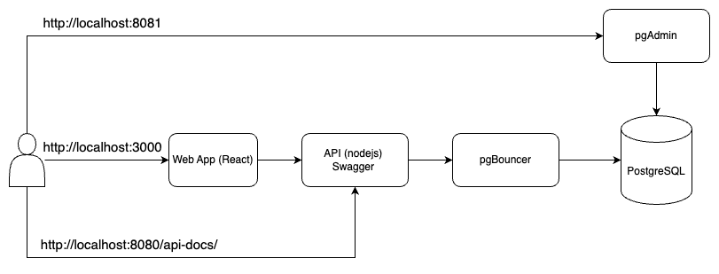
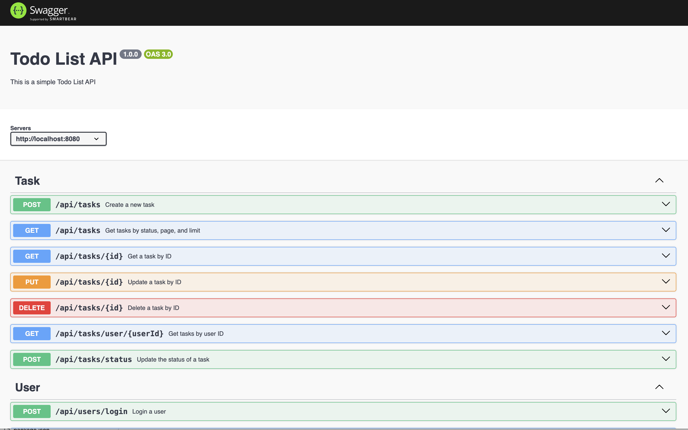
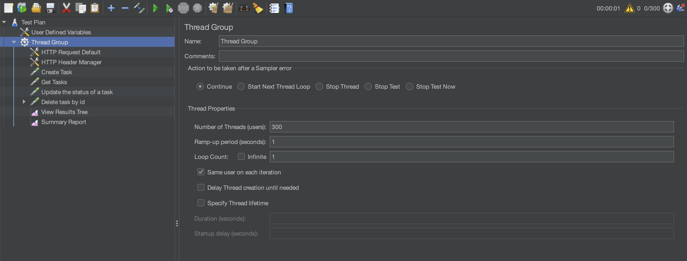
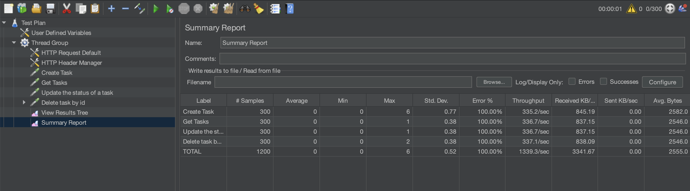

# Todo List Application

## Project Introduction

This project is a Todo List application built with Node.js, Express, TypeScript, PostgreSQL, pgAdmin and pgBouncer. It provides both web frontend and restful API endpoints for managing tasks. The project is containerized using Docker and includes load testing configurations with Apache JMeter.

### Overall Strucrture



## Step-by-Step Setup

### Prerequisites

- [Node.js](https://nodejs.org/) (v21.7.1 or later)
- [Docker](https://www.docker.com/get-started)
- [Docker Compose](https://docs.docker.com/compose/install/)

### Setup Instructions 

1. **Clone the repository**:

   ```bash
   git clone https://github.com/bluetinkwok/todolist.git
   cd todolist
   ```

2. Navigate to the backend directory:
    ```bash
    cd backend
    ```

3. Install dependencies:
    ```bash
    npm install
    ```

4. Navigate to the frontend directory:
    ```bash
    cd frontend
    ```

5. Install dependencies:
    ```bash
    npm install
    ```

6. Run the application using Docker Compose in root directory:
    ```bash
    docker-compose up --build
    ```
    This will start the both frontend and backend application along with PostgreSQL and Pgadmin containers.
    
7. Apply database migrations:
    ```bash
    docker-compose exec todolist-backend-1 npx knex migrate:latest --knexfile src/db/knexfile.ts
    ```

8. Seed the database (optional)
    ```bash
    docker-compose exec todolist-backend-1 npx knex seed:run --knexfile src/db/knexfile.ts
    ```

9. Unit test for frontend application
    ```bash
    docker exec todolist-frontend-1 npm test
    ```

10. Unit test for backend application
    ```bash
    docker exec todolist-backend-1 npm test
    ```

### Application Link and Login
| Application       | URL                     | Login Details             |
|-------------------|-------------------------|---------------------------|
| Todo App          | `http://localhost:3000` |                           |
| API               | `http://localhost:8080` |                           |
| Swagger UI        | `http://localhost:8080/api-docs` |                           |
| pgAdmin           | `http://localhost:8081` | Email: `todolist@test.com` <br> Password: `todolist` |
| Postregsql        | `http://localhost:5432` | DB: `todolist` <br/> User: `todolist` <br/> Password: `todolist` |

Todo App <br/>


Swagger <br/>


pgAdmin <br/>


## Load Test with JMeter

### Install JMeter

Refer to [Apache JMeter](https://jmeter.apache.org/download_jmeter.cgi)

### Import test case 

Import jmeter_load_test/Todolist API.jmx to the jMeter



After run the load test, you can see the result in Summary Report

